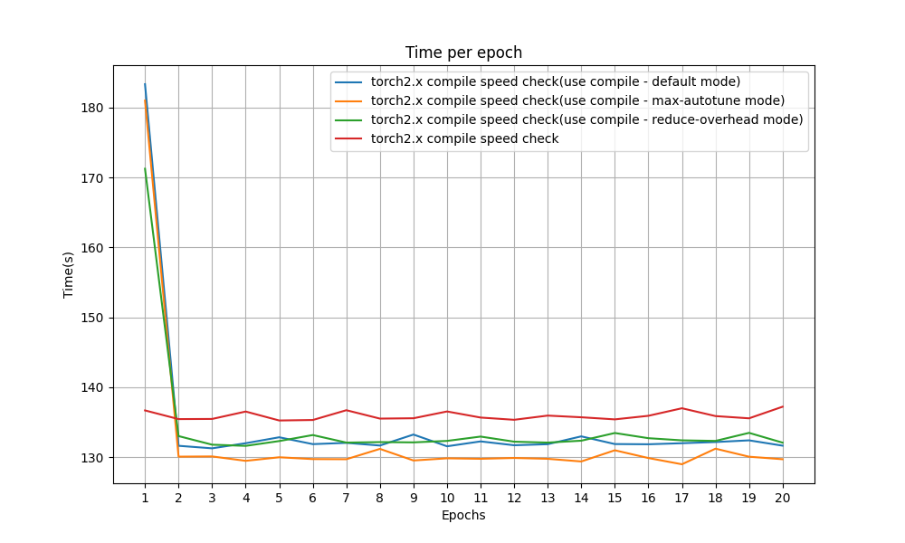

# Pytorch2.x Compile Test
pytorch2.x에서 compile 사용 유무의 학습 시간 비교

## 실험 내용
compile을 사용한 경우와 사용하지 않은 경우 간의 학습 시간 비교

## Device 사양
| Component | Specification       |
|:---------:|:-------------------:|
| CPU       | Intel i9-12900K     |
| RAM       | DDR4 128GB          |
| GPU       | NVIDIA RTX 3090 Ti  |

## 실험 방법
- Resnet50 모델을 사용하여 CIFAR-10 데이터셋을 학습시키는 시간을 비교
- 각 방법마다 20epoch학습 후 epoch별 학습 시간, 전체 학습 시간, 정확도를 비교(학습시간 : Train time + Valid time)
- 아래의 4가지 경우에 대하여 각각 시간을 측정하여 비교해 볼 예정
1. Compile 사용 안한 경우
2. Compile 사용 한 경우 - default mode
3. Compile 사용 한 경우 - reduce-overhead mode
4. Compile 사용 한 경우 - max-autotune mode

## 데이터셋 (CIFAR-10)
| Dataset Type | Number of Images |
|:------------:|:----------------:|
| Train        | 50,000           |
| Validation   | 10,000           |

## 데이터셋 전처리
1. Resize(224, 224)
2. ToTensor
3. Normalize

## 실험 결과
- 실험 결과 표

| Mode                         | Median Epoch Time (s)    | Speed up Rate (x)   | Total Time (s)   | Accuracy (%)  |
|:----------------------------:|:------------------------:|:-------------------:|:----------------:|:-------------:|
| No Compile                   | 135.7                    | -                   | 2718.0           | 91.07         |
| Compile(default)             | 131.95                   | 1.028x              | 2692.0           | 91.92         |
| Compile(reduce-overhead)     | 132.34                   | 1.025x              | 2688.0           | 91.38         |
| Compile(max-autotune)        | 129.87                   | 1.045x              | 2650.0           | 90.93         |

- Epoch별 학습 시간 비교
